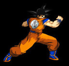

By PC.
iiManga = Juste un fanMade du jeu ii jeu de XAM (www.osxia.org) pour un concours de jeu.

Regle : Pareil que sur ii , a la difference que toucher la cible n'est pas suffisant , il faut etre sur la cible et appuyer sur une touche(fleches , ou 'a') pour prendre l'objet en question.D'ou l'utilité de la fléche du bas par exemple.

==les touches== 
<code>
(pas de maintient un tapotement suffit) 
a : superbe enchainement de karate du personnage 
(droite) : fais avancer le personnage tous seul en ligne droite 
(gauche) :pareil mais a l'envers  
(fleche de haut) : fais un saltaut vers la droite (il avance donc un peu) 
(fleche du bas) : remet le personnage en position de combat.(Utile si on ne veux pas une image fixe qui bouge pas, appuyer souvent sur cette touche) 
</code>

<em>Personnage :</em> Sangoku HR sprite 
 

Vous devez recuperer des fruits et legumes comme : 

	
to be continued...

